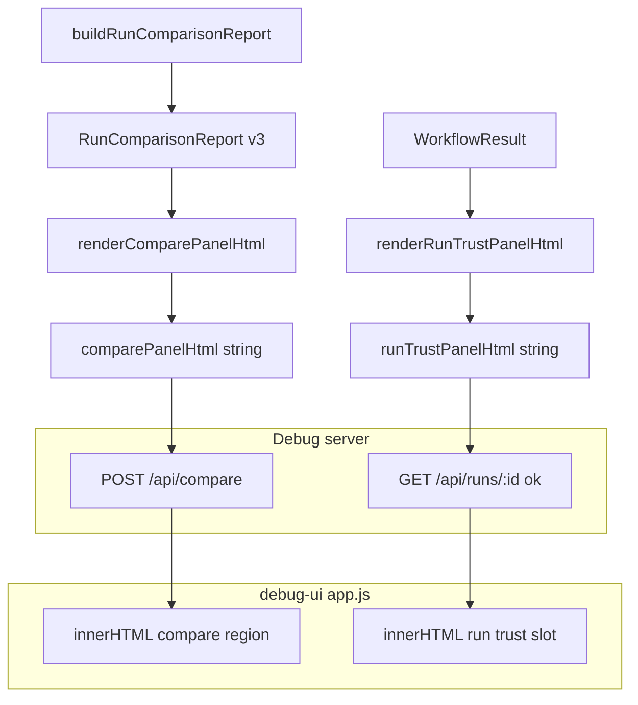

# Compare runs + independent verification (locked plan)

## Analysis

### Product requirements → engineering requirements

| Product requirement | Engineering outcome |
|-------------------|---------------------|
| **9.1** Multiple workflow results | [`buildRunComparisonReport`](src/runComparison.ts) over ordered `WorkflowResult[]` (length ≥ 2); CLI compare; [`POST /api/compare`](src/debugServer.ts). |
| **9.2** Highlight introduced / resolved / recurring | Required **`compareHighlights`** inside [`RunComparisonReport`](schemas/run-comparison-report.schema.json) v3; HTML panel lists derived **only** from `report` inside **`renderComparePanelHtml`**. |
| **9.3** Review differences across runs | Compare tab displays **`comparePanelHtml`** from API (server-rendered). |
| **9.4** Reliability improving or worsening | Required **`reliabilityAssessment`** inside v3 report; headline rendered inside **`comparePanelHtml`** with stable `data-etl-*` hooks. |
| **10.1–10.4** Trust + execution vs outcome | Run detail inserts **`runTrustPanelHtml`** from **`GET /api/runs/:id`**; content built only in **`renderRunTrustPanelHtml(WorkflowResult)`**. |

### Non-negotiable observables

- **Machine contract:** CLI compare **stdout** = **`RunComparisonReport` `schemaVersion` `3`** only (AJV `run-comparison-report`).
- **Debug HTTP contract (success paths only):** response bodies **must** have **exactly** the key sets below (no additional keys; `additionalProperties`-equivalent discipline). Types: `comparePanelHtml` and `runTrustPanelHtml` are non-empty strings; `humanSummary` is string; `report` is object (`RunComparisonReport` v3).
  - **`POST /api/compare`** `200` — keys **exactly** (UTF-16 sort order for documentation and stable tests): **`comparePanelHtml`**, **`humanSummary`**, **`report`**.
  - **`GET /api/runs/:id`** `200` when **`loadStatus === "ok"`** — keys **exactly** (UTF-16 sort order): **`agentRunRecord`**, **`capturedAtEffectiveMs`**, **`executionTrace`**, **`loadStatus`**, **`malformedEventLineCount`**, **`meta`**, **`paths`**, **`runId`**, **`runTrustPanelHtml`**, **`workflowResult`**, **`workflowVerdictSurface`**.
- **Rendering boundary:** **`comparePanelHtml`** and **`runTrustPanelHtml`** are produced **only** in Node by **`renderComparePanelHtml`** / **`renderRunTrustPanelHtml`** in a single module (e.g. [`src/debugPanels.ts`](src/debugPanels.ts)). [`debug-ui/app.js`](debug-ui/app.js) **must** assign those strings to `innerHTML` for the compare output region and run-detail trust slot **without** recomputing highlights, reliability, or trust rows in the browser.

### Must not happen / boundaries

- **No** second compare JSON contract; **no** view-model JSON on the wire for these panels.
- **No** browser-bundled duplicate renderer for compare/trust panels.
- **No** optional docs: **README.md** **must** add **“Compare and trust surfaces”** with links to the SSOT compare section and **`npm run test:debug-ui`**.

### Internal implementation (not an API contract)

Intermediate structs (e.g. row DTOs) inside `debugPanels.ts` are **private** to that file; tests target **exported render functions** and **HTML output** (and Vitest AC tests target **report JSON** where specified below).

---

## Design

### Locked architecture

### Report v3 contents

Unchanged from prior revision: required **`reliabilityAssessment`** (windowTrend, pairwiseTrend, recurrenceBurden, headlineVerdict, headlineRationale — same preorder and headline priority rules) and required **`compareHighlights`** (capped lists, UTF-16 sort). **`formatRunComparisonReport`** appends a **`reliability_assessment:`** block.

### HTML contracts (normative)

**`renderComparePanelHtml(report)`** output:

- Root **`<section data-etl-section="compare-result">`**.
- Child **`
`** — **exact format** `${headlineVerdict}: ${headlineRationale}` (fixed in code and Vitest golden).
- **`
`**, **`
`**, **`
`** — each a **single line** of text derived only from `reliabilityAssessment` / `compareHighlights` / `recurrence` (exact templates frozen in Vitest golden for a pinned report fixture).
- **`<ul data-etl-list="introduced">`**, **`<ul data-etl-list="resolved">`**, **`<ul data-etl-list="recurring">`** — list items from `compareHighlights` caps; **empty lists = `<ul>` with zero `<li>` children** (no placeholder `<li>`).

**`renderRunTrustPanelHtml(workflowResult)`** output:

- Root **`<section data-etl-section="run-trust">`**.
- First child **`
`** — **exact** string: `Verification outcomes below are from read-only SQL reconciliation against the workflow registry and observed tool parameters—not from model-reported success.`
- **`<table data-etl-table="verify-evidence">`**: rows join truth vs engine steps on **`seq`**; each data row **`tr data-etl-seq="<n>"`**; misalignment rows **`tr data-etl-alignment-warning="true"`** with fixed copy per SSOT.
- **`td data-etl-field="sql-evidence"`** — content **only** from **`formatSqlEvidenceDetailForTrustPanel(stepOutcome)`** (single TS helper, Vitest-golden per fixture category).
- **`<section data-etl-section="execution-path">`**: if no concerns → single child **`
`** with **exact** text `No execution-path concerns recorded for this run.`; else **`
`** (verbatim trimmed summary) + **`<ol data-etl-list="execution-findings">`** with **`<li data-etl-finding-code="...">`** per finding (`code` + `message`, full text, escaped).

**Escaping:** Both renderers **must** HTML-escape all dynamic text (toolId, messages, keys) to prevent XSS and keep Playwright stable.

### Failure modes

- Compare errors: **unchanged** — **no** `comparePanelHtml` on non-200 (stdout empty on CLI exit 3).
- v2 report files: **out of scope** for auto-upgrade on compare input — compare-input normalizer still produces engine result → **v3 report** on success; document breaking change for saved v2 compare **outputs**.

---

## Implementation

Deterministic order:

1. **Schema + `buildRunComparisonReport` / `formatRunComparisonReport`** — v3 with `reliabilityAssessment` + `compareHighlights`.
2. **`src/debugPanels.ts`** — implement `renderComparePanelHtml`, `renderRunTrustPanelHtml`, `formatSqlEvidenceDetailForTrustPanel`; export only the two renderers (+ helper if tests need it).
3. **Vitest** — `src/debugPanels.test.ts` golden strings for both renderers; extend `runComparison.test.ts` for v3 and AC 9.2 fixture.
4. **`debugServer.ts`** — wire POST/GET responses; **`comparePanelHtml`** and **`runTrustPanelHtml`** non-empty on success; **no other keys** on those success bodies. Add **`src/debugServer.test.ts`** tests **`it("debug_api_POST_compare_200_json_has_exact_keys", …)`** and **`it("debug_api_GET_run_detail_ok_json_has_exact_keys", …)`** that `Object.keys(res).sort((a,b)=>a.localeCompare(b))` equals the **pinned UTF-16-sorted arrays** from the contract above (same arrays as documented in SSOT).
5. **`debug-ui/app.js` + `index.html`** — compare and run-detail use **only** `comparePanelHtml` / `runTrustPanelHtml`.
6. **Playwright** — specs under `test/debug-ui/` using corpus `test/fixtures/debug-ui-compare/`.
7. **`package.json`** — `"test:debug-ui": "playwright test"`; **`test:ci`** **must** end with **`npx playwright install chromium`** then **`npm run test:debug-ui`** (same order every time; no separate “document install” step).
8. **README + SSOT** — compare/trust + API keys + HTML hook list + breaking v2→v3.

---

## Testing

| Layer | Role |
|-------|------|
| Vitest | Report JSON, `formatRunComparisonReport`, **exact HTML** from `renderComparePanelHtml` / `renderRunTrustPanelHtml` for pinned fixtures |
| Playwright | End-to-end Debug server + browser: assertions use substrings from **`test/fixtures/debug-ui-compare/expected-strings.json`** only (same file as Vitest substring checks). |

**Drift guard (required):** Single file **`test/fixtures/debug-ui-compare/expected-strings.json`** holds every substring used in Playwright assertions and any matching Vitest substring checks. **Vitest** and **Playwright** both load that path relative to repo root (same Node `readFileSync` / `JSON.parse` pattern in both); **no** duplicate expected literals in spec files except the JSON itself.

---

## Documentation

- **README.md:** Required **“Compare and trust surfaces”**: v3 stdout, pointer to SSOT for Debug API success shapes, `npm run test:debug-ui`, link to SSOT.
- **`docs/workflow-verifier.md`:** Compare runs matrix; **Debug API (normative success shapes)** subsection that **copies the same key lists** as Non-negotiable observables (compare `200`: `comparePanelHtml`, `humanSummary`, `report`; run detail `200` ok: full eleven-key list in UTF-16 sorted order); **HTML hooks** table; reliability algorithm; v3 breaking note; reference **`debug_api_*_exact_keys`** tests as enforcement.

---

## Validation

Each row has **exactly one** primary proof path: **one** test file and **one** `test` or `it` block (a single Playwright `test` may contain sequential assertions for two fixture runs if needed). **No** substitutes.

| AC | Primary proof |
|----|----------------|
| **9.1** | **`src/compare.acceptance.test.ts`** — **`it("AC_9_1_multi_run_compare_emits_schema_v3", …)`**: `buildRunComparisonReport` with **three** normalized `WorkflowResult` fixtures, AJV-valid v3, `report.runs.length === 3`. |
| **9.2** | **`src/compare.acceptance.test.ts`** — **`it("AC_9_2_compareHighlights_match_fixture", …)`**: `toEqual` pinned golden object for `compareHighlights` (fixture path named in test file). |
| **9.3** | **`test/debug-ui/ac-9-3.spec.ts`** — **`test("AC_9_3_compare_panel_markup", …)`**: POST compare with **≥2** run ids from `test/fixtures/debug-ui-compare/`; `page.locator('[data-etl-section="compare-result"]')` visible; **all four** elements **`[data-etl-headline]`**, **`[data-etl-window-trend]`**, **`[data-etl-pairwise-trend]`**, **`[data-etl-recurrence]`** present; **all three** lists **`ul[data-etl-list="introduced"]`**, **`resolved`**, **`recurring`** present. |
| **9.4** | **`src/compare.acceptance.test.ts`** — **`it("AC_9_4_headlineVerdict_window_pairwise_divergence", …)`**: pinned multi-run fixture where `windowTrend !== pairwiseTrend`; assert **`headlineVerdict`** and **full** **`headlineRationale`** **exact** match **`test/fixtures/debug-ui-compare/headline-ac-9-4.json`** (sole golden for this assertion). |
| **10.1–10.2** | **`src/verificationAgainstSystemState.requirements.test.ts`** — **`it("AC_10_1_AC_10_2_independent_sql_evidence_not_execution_narrative", async () => { … })`** (**this test must be added** inside the existing `describe("Verification against system state (requirements)", …)`; it is the **only** named proof for this row). **Required setup:** use the **same** pattern as tests **A/B** in that file: temp DB created from **`examples/seed.sql`** (via `beforeAll`), **`examples/events.ndjson`**, **`examples/tools.json`**, `database: { kind: "sqlite", path: dbPath }`. **Required call:** `verifyWorkflow({ workflowId: "wf_missing", eventsPath, registryPath, database: sqliteDb(), logStep: noop, truthReport: noop })`. **Required assertions:** `steps[0].status === "missing"`, `steps[0].reasons[0].code === "ROW_ABSENT"`, `steps[0].evidenceSummary.rowCount === 0`, `workflowTruthReport.steps[0].outcomeLabel === "FAILED_ROW_MISSING"`. **Proves:** verdict is fixed by **read-only SQL** + registry for that key, not by inferring success from the observation alone. |
| **10.3** | **`test/debug-ui/ac-10-3.spec.ts`** — **`test("AC_10_3_sql_evidence_column", …)`**: GET run detail for fixture run; `locator('[data-etl-field="sql-evidence"]')` first row text **contains** substring from **`expected-strings.json`**. |
| **10.4** | **`test/debug-ui/ac-10-4.spec.ts`** — **`test("AC_10_4_execution_path", …)`** (single test): open fixture run **with** `executionPathFindings` → assert expected finding `code` text visible; then open fixture run **without** concerns → assert execution-path section text **equals** `expected-strings.json` **`executionPathEmpty`** value **exactly**. |

**Binary verdict:** **`npm run test:ci`** passes (including **`npx playwright install chromium`** + **`npm run test:debug-ui`**) and every **Primary proof** row above is green **and** **`src/debugServer.test.ts`** tests **`debug_api_POST_compare_200_json_has_exact_keys`** and **`debug_api_GET_run_detail_ok_json_has_exact_keys`** are green. **Not solved** if any AC row lacks that named test, if either debug API exact-key test fails, or if any substitute proof is used.
