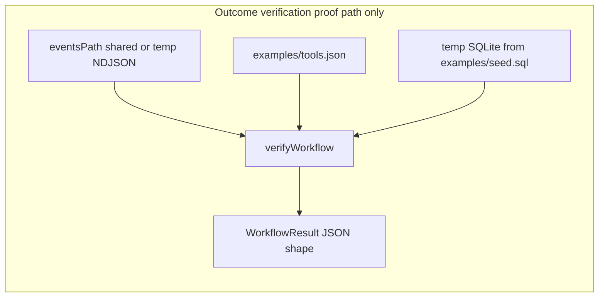

# Verify outcomes against system state (implementation plan)

## Analysis

### Engineering requirements (from product text, not redefined)

| Product intent | Engineering requirement |
|----------------|---------------------------|
| Evaluate whether each workflow step’s expected outcome appears in real system state | For every logical `tool_observed` step (`seq`), resolve a `VerificationRequest` from registry + params, then compare read-only SQL rows to that request ([`pipeline.ts`](c:/Users/kavan/OneDrive/projects/workflow-verifier/src/pipeline.ts) `verifyWorkflow`, [`reconciler.ts`](c:/Users/kavan/OneDrive/projects/workflow-verifier/src/reconciler.ts)). |
| Evidence must not be the workflow/agent “success” claim | Expectations come only from registry + `params`; wire events must not carry expectation blobs; verdict uses DB read results reflected in `reasons` and `evidenceSummary`. |
| Clear verification result per evaluated step | `WorkflowResult.steps[]` and `workflowTruthReport.steps[]` (and human `result=` lines) carry per-step status and labels. |
| Flag when outcome not reflected | Non-`verified` step statuses with reasons. |
| Detect absent records / wrong values | `ROW_ABSENT`, `VALUE_MISMATCH` (and related codes) with structured evidence. |
| Distinguish verified vs failed verification | `status === "verified"` vs other statuses; matching `outcomeLabel` on truth report. |
| See which steps are affected | Each step carries `seq` and `toolId`; multi-step workflows yield multiple `steps[]` entries aligned with evaluation order. |

### What must be built

1. One **documentation** subsection mapping acceptance criteria → emitted fields and codes (link to existing Human truth report / reconciler sections; schemas remain shape SSOT).
2. One **Vitest** module [`src/verificationAgainstSystemState.requirements.test.ts`](c:/Users/kavan/OneDrive/projects/workflow-verifier/src/verificationAgainstSystemState.requirements.test.ts) that proves outcome verification using **only** the path defined under Design (no second test style).

### What must not happen (constraints / out of scope)

- No new verification backend or duplicate “verifier” abstraction.
- No new `StepStatus` or `outcomeLabel` literals; this work does not change the taxonomy.
- No relaxation of the event schema (no expectations on the wire).

### What must be provable (observability artifacts)

- Emitted `WorkflowResult` from `verifyWorkflow` (stdout-shaped object): `steps`, `workflowTruthReport.steps`, `reasons`, `evidenceSummary`.
- AJV result for a forbidden event shape, executed inside the new Vitest file (see Testing).

---

## Design

### Single architecture

All new proofs use **one mechanism**: `await verifyWorkflow({ workflowId, eventsPath, registryPath, database, logStep: noop, truthReport: noop })` from [`src/pipeline.ts`](c:/Users/kavan/OneDrive/projects/workflow-verifier/src/pipeline.ts) (Vitest imports `./pipeline.js` like other `src/*.test.ts` files).

**Database:** Before each test file run (or `beforeAll`), create a **temporary directory**, materialize SQLite at `join(dir, "verify.db")` by executing **exactly** the contents of [`examples/seed.sql`](c:/Users/kavan/OneDrive/projects/workflow-verifier/examples/seed.sql) via `DatabaseSync` — same pattern as [`test/pipeline.sqlite.test.mjs`](c:/Users/kavan/OneDrive/projects/workflow-verifier/test/pipeline.sqlite.test.mjs) lines 20–27. **Tear down** the directory in `afterAll`. **No** `demo.db`, **no** Postgres, **no** direct `reconcileFromRows` calls in these tests.

**Events and registry:**

- **Shared files:** `eventsPath = join(repoRoot, "examples", "events.ndjson")`, `registryPath = join(repoRoot, "examples", "tools.json")`, where `repoRoot = join(dirname(fileURLToPath(import.meta.url)), "..")` (parent of `src/`).
- **Ephemeral NDJSON:** For cases not present in `examples/events.ndjson`, write **only** under the temp directory (same pattern as `wf_fake_ok` / `wf_omit_order` in [`test/pipeline.sqlite.test.mjs`](c:/Users/kavan/OneDrive/projects/workflow-verifier/test/pipeline.sqlite.test.mjs)).

**Policy:** `verificationPolicy` omitted → library defaults (**strong**, single read per check).

### Requirement satisfaction (explicit)

- **Outcome vs SQL:** `verifyWorkflow` resolves expectations from registry + observations, reads SQL, emits per-step results; no success flag from the agent is consulted.
- **Non-success kinds:** `missing`, `inconsistent`, `partially_verified`, `incomplete_verification`, `uncertain` remain the distinct non-success outcomes; this plan documents and tests representative cases reachable on the SQLite path above.

### Failure modes (reference)

| User-visible situation | Assert via `verifyWorkflow` + seed data |
|------------------------|----------------------------------------|
| Row absent | `wf_missing` (shared `events.ndjson`) |
| Value mismatch | `wf_partial` or `wf_inconsistent` |
| Duplicate keys | `wf_duplicate_rows` + `dups` table in seed |
| Observation present but DB does not back it | `wf_missing`; ephemeral `wf_fake_ok` with `params.ok: true` and nonexistent `recordId` (mirrors existing pipeline test intent) |

---

## Implementation

1. **Documentation** — Add subsection **“Product requirements: outcome verification”** to [`docs/execution-truth-layer.md`](c:/Users/kavan/OneDrive/projects/workflow-verifier/docs/execution-truth-layer.md): map each acceptance bullet to `WorkflowResult` / `workflowTruthReport` fields and typical `reasons[].code` values, with links to Human truth report and Reconciler rule table. **Completion:** subsection merged; no new duplicate field tables (schemas stay SSOT).

2. **Tests** — Create [`src/verificationAgainstSystemState.requirements.test.ts`](c:/Users/kavan/OneDrive/projects/workflow-verifier/src/verificationAgainstSystemState.requirements.test.ts) implementing **exactly** the seven cases listed in Testing (fixed names below). **Completion:** file exists and `npm run test:vitest` includes it (default Vitest `include` already covers `src/**/*.test.ts`).

3. **Verification** — From repository root after dependencies are installed, run **`npm test`**. **Completion:** process exits **0**. This is the **only** completion command (runs `build`, Vitest, SQLite `node:test` suite including existing pipeline tests, and `first-run`). No alternate local command and no “if Postgres” branch for this plan.

---

## Testing

**Method (non-negotiable):** Every case below invokes **`verifyWorkflow`** with `database: { kind: "sqlite", path: dbPath }` and the temp DB seeded from **`examples/seed.sql`**. Assertions use **only** the fulfilled `WorkflowResult` (and, for case G, the boolean return of `loadSchemaValidator("event")`).

**Observable-only rule:** Do not assert internal call graphs or that a particular function “was” invoked. Assert **public outputs**: `status`, `steps[n].status`, `steps[n].reasons`, `steps[n].evidenceSummary`, `steps[n].verificationRequest`, `workflowTruthReport.steps[n].outcomeLabel`, and when relevant `workflowTruthReport.failureAnalysis` evidence entries containing `seq`.

| ID | Requirement focus | Fixed setup | Black-box expectations |
|----|-------------------|-------------|-------------------------|
| A | Verified outcome matches DB | `workflowId: "wf_complete"`, `eventsPath` + `registryPath` = shared `examples` paths | `r.status === "complete"`; `r.steps[0].status === "verified"`; `r.steps[0].reasons` empty; `r.workflowTruthReport.steps[0].outcomeLabel === "VERIFIED"`; `r.steps[0].evidenceSummary.rowCount === 1`; `loadSchemaValidator("workflow-result")(r) === true` |
| B | Missing record despite capture | `workflowId: "wf_missing"`, shared events | `r.steps[0].status === "missing"`; `r.steps[0].reasons[0].code === "ROW_ABSENT"`; `r.steps[0].evidenceSummary.rowCount === 0`; truth `outcomeLabel === "FAILED_ROW_MISSING"` |
| C | Falsification: observation + “success-shaped” params do not imply verified | Ephemeral NDJSON in temp dir: one `tool_observed` line, `workflowId: "wf_verify_fake_ok"`, `params: { ok: true, recordId: "nope", fields: { name: "x", status: "y" } }` (same shape as [`test/pipeline.sqlite.test.mjs`](c:/Users/kavan/OneDrive/projects/workflow-verifier/test/pipeline.sqlite.test.mjs) “ignores params.ok”) | `r.steps[0].status === "missing"` (not `verified`); `r.steps[0].reasons[0].code === "ROW_ABSENT"` — **fails if** a future shortcut trusts `ok` or presence of the event alone |
| D | Wrong value vs expected | `workflowId: "wf_partial"`, shared events | `r.steps[0].status === "inconsistent"`; `r.steps[0].reasons[0].code === "VALUE_MISMATCH"`; `evidenceSummary` has `expected`, `actual`, `field`; truth `outcomeLabel === "FAILED_VALUE_MISMATCH"` |
| E | Duplicate rows in system state | `workflowId: "wf_duplicate_rows"`, shared events | `r.steps[0].status === "inconsistent"`; `r.steps[0].reasons[0].code === "DUPLICATE_ROWS"` |
| F | Which step failed (multi-step) | Ephemeral NDJSON in temp dir: two lines, same `workflowId: "wf_verify_twostep"`, `seq` 0 then 1 — line 0 same params as `wf_complete` line; line 1 same as `wf_missing` (recordId `missing_id`) | `r.steps.length === 2`; `r.steps[0].seq === 0`, `r.steps[0].status === "verified"`; `r.steps[1].seq === 1`, `r.steps[1].status === "missing"`; `r.workflowTruthReport.steps[0].seq === 0`, `outcomeLabel === "VERIFIED"`; `r.workflowTruthReport.steps[1].seq === 1`, `outcomeLabel === "FAILED_ROW_MISSING"` |
| G | Expectations cannot be smuggled on the event | In-test object: valid `tool_observed` fields plus `"expectation": {}` | `loadSchemaValidator("event")` from [`src/schemaLoad.ts`](c:/Users/kavan/OneDrive/projects/workflow-verifier/src/schemaLoad.ts) returns **false** for that object — **fails if** wire schema ever allows caller-supplied expectation payloads |

**Regression bar:** Cases B and C fail if verification ignores DB state; case D fails if value checks regress; case G fails if the event schema regresses to allow embedded expectations.

---

## Documentation

- Add the outcome verification mapping subsection only; keep schemas as structural SSOT.
- Audiences: **Engineer** (modules + test file name), **Integrator** (parse `WorkflowResult`; expectations not on events), **Operator** (human report `seq=` / `result=` / `reference_code:`).
- **Why:** One verifier (`verifyWorkflow` + reconciler) stays authoritative; documentation explains PRD mapping without introducing a parallel spec.

---

## Validation

| Product requirement | Proof produced by this plan | Negative / falsification |
|--------------------|------------------------------|---------------------------|
| Outcome evaluated against system state | Test **A** (`evidenceSummary.rowCount`, verified status); **B**/`**D**/`**E** tie failures to DB-backed codes and evidence | **B** fails if row absent yields `verified` |
| Not based on workflow success claim | **C** (fake `ok` + missing row still `missing`); **G** (embedded `expectation` rejected) | **C** fails if `ok: true` or observation alone yields `verified`; **G** fails if schema accepts `expectation` |
| Clear result per step | **A**–**F** assert `steps[]` and `workflowTruthReport.steps[].outcomeLabel` | **D** must not report `VERIFIED` |
| Flag not reflected | **B**, **D**, **E** non-verified statuses with reasons | **E** must not collapse to `verified` |
| Absent / incorrect values | **B** (`ROW_ABSENT`, `rowCount: 0`), **D** (`VALUE_MISMATCH` + expected/actual) | **D** missing `expected`/`actual` in evidence fails the test |
| Verified vs failed distinct | **A** vs **B**/**D**/**E** on `status` and `outcomeLabel`; **A** must satisfy emitted schema — verified step has no `failureDiagnostic` property | **A** fails AJV validation against [`schemas/workflow-result.schema.json`](c:/Users/kavan/OneDrive/projects/workflow-verifier/schemas/workflow-result.schema.json) if `failureDiagnostic` appears on a verified step |
| Which steps affected | **F** identifies failing step by `seq: 1` while `seq: 0` passes | Reordering or merging steps without updating assertions fails **F** |

**Simulation:** All cases use real `verifyWorkflow` + seeded SQLite (no mocks).

**Binary verdict:** **Solved** iff the documentation subsection is merged, `src/verificationAgainstSystemState.requirements.test.ts` exists with cases **A–G**, and **`npm test` exits 0**. **Not solved** otherwise.
