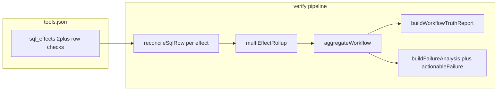

# Partial multi-effect detection and actionable verification feedback

## Analysis

### Engineering requirements (from product text, not redefined)

- **R4a — Detect partial completion:** When a registry step uses **`sql_effects`** (≥2 row checks), the engine must classify outcomes so that a mix of satisfied and unsatisfied row-level checks is **not** reported as full success or as an undifferentiated single failure when some checks passed.
- **R4b — Surface partial vs success vs failure:** Emit a **distinct step status** for true partial DB outcomes (`partially_verified`) vs all failed (`inconsistent` + `MULTI_EFFECT_ALL_FAILED`) vs cannot complete checks (`incomplete_verification` + `MULTI_EFFECT_INCOMPLETE`) vs all verified (`verified`).
- **R4c — Observable decomposition:** Consumers must be able to see **which effect ids** passed vs failed and **why** each non-verified effect failed (reconciler codes/messages), in both **structured** (`WorkflowResult` / `workflowTruthReport`) and **human** truth report output.
- **R4d — Workflow rollup:** Partial completion must drive **`WorkflowResult.status`** per existing precedence in [`aggregate.ts`](c:\Users\kavan\OneDrive\projects\workflow-verifier\src\aggregate.ts) (`partially_verified` → workflow `inconsistent`, same family as `missing`/`inconsistent`).

- **R7a — Explain non-verification:** For any non-`verified` step, surface **why** verification did not succeed using stable reason codes and human-readable messages.
- **R7b — Operator readability:** A human reviewing stderr (truth report) or JSON must identify **step** (`seq`, `toolId`), **expected verification target** (`verifyTarget` / `verificationRequest`), **observed execution digest** (`observedExecution.paramsCanonical`), and **problem** (reasons / per-effect reasons).
- **R7c — Distinguish failure kinds for action:** Different verification outcomes (row missing vs value mismatch vs duplicate rows vs incomplete read/shape vs multi-effect rollups vs eventual window uncertainty) must remain **machine-distinguishable** (`outcomeLabel`, `failureDiagnostic`, `reasons[].code`, `failureAnalysis` + `actionableFailure`) without requiring operators to infer from implementation details.

### What must be built (non-negotiable)

Leverage and **prove** the existing implementation path: [`multiEffectRollup.ts`](c:\Users\kavan\OneDrive\projects\workflow-verifier\src\multiEffectRollup.ts) → [`verificationPolicy.ts`](c:\Users\kavan\OneDrive\projects\workflow-verifier\src\verificationPolicy.ts) → [`workflowTruthReport.ts`](c:\Users\kavan\OneDrive\projects\workflow-verifier\src\workflowTruthReport.ts) / [`failureAnalysis.ts`](c:\Users\kavan\OneDrive\projects\workflow-verifier\src\failureAnalysis.ts) / [`actionableFailure.ts`](c:\Users\kavan\OneDrive\projects\workflow-verifier\src\actionableFailure.ts). **Deliverables:** (1) reproducible **end-to-end** fixtures + tests that assert R4/R7 observables, (2) **tighter step-level summary strings** for multi-effect rollups so the top-line reason encodes *kind* per failed effect (complementing per-effect lines), (3) **one P5 failure-analysis sentence** when the driver step is a multi-effect rollup so JSON diagnosis explicitly points to per-effect evidence, (4) **documentation** mapping AC → exact JSON/human fields (SSOT: extend existing doc section, no second field catalog).

### What must not happen

- Do **not** introduce a second parallel “outcome” model (no duplicate status enums, no UI-only state).
- Do **not** bump JSON schema versions unless a **required** new field is unavoidable; prefer messages + tests + docs first.
- Do **not** treat **`sql_row`** as multi-effect: partial completion in this product sense is **only** defined where the registry declares **`sql_effects`** (schema already requires ≥2 effects in [`workflow-engine-result.schema.json`](c:\Users\kavan\OneDrive\projects\workflow-verifier\schemas\workflow-engine-result.schema.json)).

### What must be provable

- CI tests that fail if: partial multi-effect is misclassified, per-effect evidence disappears from emitted `WorkflowResult`, truth report omits effect blocks, workflow status rollup ignores `partially_verified`, or failure analysis/actionable classification regresses for multi-effect drivers.
- Doc pointers: exact paths under `WorkflowResult.steps[]`, `workflowTruthReport.steps[]`, and `workflowTruthReport.failureAnalysis`.

---

## Design

### Architecture (single path)

- **Contracts (unchanged):** Step `status` + `reasons` + `evidenceSummary.effects[]` (`id`, `status`, `reasons`, `evidenceSummary`) per [`workflow-engine-result.schema.json`](c:\Users\kavan\OneDrive\projects\workflow-verifier\schemas\workflow-engine-result.schema.json) `$defs/effectOutcome` and conditional step `evidenceSummary`.
- **Human report:** Step line + per-effect `effect: id=… result=…` + nested `detail` / `reference_code` (already specified in [`docs/execution-truth-layer.md`](c:\Users\kavan\OneDrive\projects\workflow-verifier\docs\execution-truth-layer.md)).
- **Failure feedback:** [`failureAnalysis.ts`](c:\Users\kavan\OneDrive\projects\workflow-verifier\src\failureAnalysis.ts) `primaryCodeForStep` already substitutes the **first failing effect’s** reconciler code when the step reason is a `MULTI_EFFECT_*` rollup; **extend only** `buildSummary` for P5 when the driver’s step-level code is in `MULTI_EFFECT_ROLLUP_CODES` to append a single normative clause: multi-effect step at `seq`/`toolId`, primary driver code, and explicit pointer to `workflowTruthReport.steps[].effects` (wording only; no new JSON fields).

### How this satisfies each requirement

| Requirement | Mechanism |
|-------------|-----------|
| R4a–R4b | Existing rollup rules in [`multiEffectRollup.ts`](c:\Users\kavan\OneDrive\projects\workflow-verifier\src\multiEffectRollup.ts); tests prove behavior on real DB |
| R4c | `evidenceSummary.effects` + truth `steps[].effects[]` + improved rollup **message** listing `id (PRIMARY_CODE)` for each non-verified effect |
| R4d | Unchanged [`aggregate.ts`](c:\Users\kavan\OneDrive\projects\workflow-verifier\src\aggregate.ts); tests assert `status === "inconsistent"` for partial |
| R7a–R7c | Per-step/per-effect reasons + `failureDiagnostic` + `failureAnalysis`/`actionableFailure`; tests assert codes and categories; P5 summary clarifies multi-effect |

### Failure modes (explicit behavior)

- **Any effect `incomplete_verification`:** Step remains `incomplete_verification` (workflow `incomplete`); per-effect rows still list which effects are verified vs incomplete — **do not** collapse to `partially_verified` (preserves “cannot confirm” vs “confirmed partial bad state”).
- **All effects `missing` or `inconsistent`:** Step `inconsistent`, `MULTI_EFFECT_ALL_FAILED`.
- **Mix verified + (missing or inconsistent), no incomplete:** Step `partially_verified`, `MULTI_EFFECT_PARTIAL`.
- **Eventual window timeout with all still missing:** `uncertain` + `MULTI_EFFECT_UNCERTAIN_WITHIN_WINDOW` (existing [`verificationPolicy.ts`](c:\Users\kavan\OneDrive\projects\workflow-verifier\src\verificationPolicy.ts)); out of scope to change unless tests expose a bug.

---

## Implementation

Ordered steps; each completes when the stated condition is true.

1. **Extend [`examples/seed.sql`](c:\Users\kavan\OneDrive\projects\workflow-verifier\examples\seed.sql)** with the minimum extra `contacts` rows (or a small second table if cleaner) needed for: (a) multi-effect **all verified**, (b) **partial** (one key matches, one absent or value mismatch), (c) **all failed** (both keys absent), (d) optional **incomplete** path is better mocked via reconciler in unit tests only — **do not** require flaky connector errors in E2E; keep E2E to determinate DB states.  
   **Done when:** Seed applies cleanly in existing test harness and supports the three deterministic multi-effect scenarios.

2. **Add one `sql_effects` tool** to [`examples/tools.json`](c:\Users\kavan\OneDrive\projects\workflow-verifier\examples\tools.json) (e.g. `crm.upsert_contact_multi`) with two effects with stable ids (`primary`, `secondary`) pointing at `contacts` keys derived from params (reuse pointer patterns from existing `crm.upsert_contact`).  
   **Done when:** `validate-registry` passes and `resolveExpectation` yields `sql_effects` for sample params.

3. **Improve rollup messages** in [`multiEffectRollup.ts`](c:\Users\kavan\OneDrive\projects\workflow-verifier\src\multiEffectRollup.ts): for `MULTI_EFFECT_PARTIAL` and `MULTI_EFFECT_ALL_FAILED`, append per-failed-effect **`id` + primary `reasons[0].code`** (fallback if empty). Keep messages within operational length conventions ([`failureCatalog.ts`](c:\Users\kavan\OneDrive\projects\workflow-verifier\src\failureCatalog.ts) / `formatOperationalMessage` if already used for reasons).  
   **Done when:** Unit expectations in [`multiEffectRollup.test.ts`](c:\Users\kavan\OneDrive\projects\workflow-verifier\src\multiEffectRollup.test.ts) updated and green.

4. **Adjust P5 summary** in [`failureAnalysis.ts`](c:\Users\kavan\OneDrive\projects\workflow-verifier\src\failureAnalysis.ts) when `driverStep.reasons[0]?.code` is in `MULTI_EFFECT_ROLLUP_CODES`: append one sentence that states verification is a multi-effect step and that per-effect outcomes are authoritative in structured truth (`workflowTruthReport.steps[].effects`).  
   **Done when:** [`workflowTruthReport.test.mjs`](c:\Users\kavan\OneDrive\projects\workflow-verifier\test\workflowTruthReport.test.mjs) or focused Vitest for `buildFailureAnalysis` reflects the new summary substring for a golden multi-effect fixture.

5. **Sync any message snapshots** (e.g. [`test/workflowTruthReport.test.mjs`](c:\Users\kavan\OneDrive\projects\workflow-verifier\test\workflowTruthReport.test.mjs), [`src/schema-validation.test.ts`](c:\Users\kavan\OneDrive\projects\workflow-verifier\src\schema-validation.test.ts) if it pins `MULTI_EFFECT_PARTIAL` text).  
   **Done when:** Full test suite passes.

---

## Testing

All tests assert **observable outputs**, not internal call order.

1. **Unit:** [`multiEffectRollup.test.ts`](c:\Users\kavan\OneDrive\projects\workflow-verifier\src\multiEffectRollup.test.ts) — extend cases so `MULTI_EFFECT_PARTIAL` / `MULTI_EFFECT_ALL_FAILED` messages include effect id + code for each failed effect; keep UTF-16 id sort behavior.

2. **Black-box / requirements:** extend [`src/verificationAgainstSystemState.requirements.test.ts`](c:\Users\kavan\OneDrive\projects\workflow-verifier\src\verificationAgainstSystemState.requirements.test.ts) with new workflows (inline NDJSON like existing tests):
   - **H — Multi-effect partial:** `steps[0].status === "partially_verified"`; `reasons[0].code === "MULTI_EFFECT_PARTIAL"`; `evidenceSummary.effects` length 2 with one `verified` and one `missing` or `inconsistent`; `workflowTruthReport.steps[0].outcomeLabel === "PARTIALLY_VERIFIED"`; `effects` array present with matching per-effect `outcomeLabel`; **`workflowResult.status === "inconsistent"`**; schema validator passes.
   - **I — Multi-effect all failed:** `inconsistent` step + `MULTI_EFFECT_ALL_FAILED`; both effects non-verified; workflow `inconsistent`.
   - **J — Multi-effect all verified:** step `verified`; workflow `complete` (single-step workflow id).
   - **K — Actionable feedback (single-effect regression guard):** on an existing failing workflow (e.g. `wf_missing` or `wf_partial`), assert `failureAnalysis !== null`, `failureAnalysis.evidence` references the failing step, `actionableFailure.category` is the expected stable category from [`actionableFailure.ts`](c:\Users\kavan\OneDrive\projects\workflow-verifier\src\actionableFailure.ts), and `steps[0].failureDiagnostic` is present and matches [`verificationDiagnostics.ts`](c:\Users\kavan\OneDrive\projects\workflow-verifier\src\verificationDiagnostics.ts) rules.
   - **L — Actionable feedback (multi-effect driver):** on workflow H, assert `failureAnalysis` primary evidence includes effect scope or step scope consistent with [`failureAnalysis.ts`](c:\Users\kavan\OneDrive\projects\workflow-verifier\src\failureAnalysis.ts) lines 355–371; `actionableFailure.category === "downstream_execution_failure"` (current mapping for `MULTI_EFFECT_PARTIAL`).

3. **Human report:** generate `formatWorkflowTruthReport` for workflow H and assert substrings: `seq=`, `tool=`, `verify_target:`, `effect: id=`, per-effect `reference_code:` for the failed effect’s reconciler code.

4. **Negative:** assert a deliberately wrong expectation fails (e.g. if code incorrectly maps partial to `complete`, tests fail).

---

## Documentation

Update [`docs/execution-truth-layer.md`](c:\Users\kavan\OneDrive\projects\workflow-verifier\docs\execution-truth-layer.md) only:

- In the **outcome verification** mapping table (or immediately below it), add **two rows** for multi-effect items **4** and **7**: each row lists **acceptance theme → exact artifacts** (`steps[].status` values, `evidenceSummary.effects`, `workflowTruthReport.steps[].effects`, `failureAnalysis`, `actionableFailure`, human report sections).
- Add a short **“Operator reading order”** bullet list: trust line → diagnosis → failing step → `verify_target` → step reasons → effect blocks (multi-effect).
- Update **Step rollup (multi-effect)** prose if the rollup message format changes (keep one normative description; remove duplication elsewhere only if the same sentence appears twice).

**Audience split:** one subsection labeled **Engineer** (field paths + test file names), one **Integrator** (stdout JSON paths), one **Operator** (stderr reading order). No new markdown files.

---

## Validation

| Product AC | Proof (observable) |
|------------|-------------------|
| 4 — detect some-but-not-all effects | Test H: `partially_verified` + two distinct per-effect statuses in `evidenceSummary.effects` |
| 4 — distinct from success/failure | Tests G/J vs H vs I: `verified` / `partially_verified` / `inconsistent` + workflow `complete` vs `inconsistent` |
| 4 — user sees which parts | Human report test + JSON `workflowTruthReport.steps[].effects[]` + improved `MULTI_EFFECT_*` message lists ids and codes |
| 4 — workflow result appropriate | Test H/I: `aggregate` yields `inconsistent` for partial and all-failed |
| 7 — why verification failed | Reasons + `failureAnalysis.summary` + per-effect `detail` lines |
| 7 — understandable | Operator doc reading order + unchanged plain-language phrases in [`workflowTruthReport.ts`](c:\Users\kavan\OneDrive\projects\workflow-verifier\src\workflowTruthReport.ts) |
| 7 — step, expected, observed | Assertions on `seq`, `toolId`, `verifyTarget`, `intendedEffect`, `observedExecution` in test K/L |
| 7 — distinguish kinds | `outcomeLabel`, `reasons[].code`, `failureDiagnostic`, `actionableFailure.category` assertions |

**Negative validation:** Test that `wf_complete` still has `failureAnalysis === null` and exit semantics unchanged.

**Binary verdict:** **Solved** when all implementation steps are done, full CI green, and the validation table is satisfied by automated tests + updated doc rows. **Not solved** if any AC row lacks an automated assertion or doc pointer.
