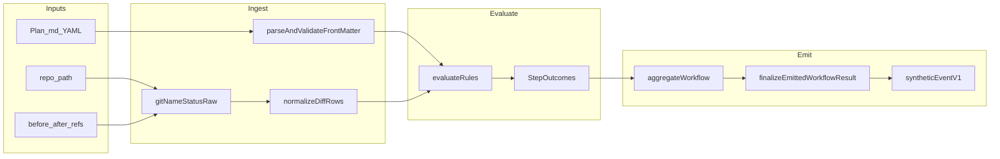

# Plan-transition validation (Before / After / Plan.md) — revised

## Analysis

### Product requirements → engineering requirements

| Non-negotiable outcome | Engineering requirement |
|------------------------|-------------------------|
| User supplies **Before**, **After**, **`Plan.md`** | CLI `workflow-verifier plan-transition --repo <path> --before <ref> --after <ref> --plan <path>`; optional `--workflow-id` defaulting to `wf_plan_transition`. |
| Answer: **does Before→After match the intended change described in Plan.md?** | **Normative narrowing (honest scope):** the *described* intent is whatever is **machine-declared** in YAML front matter under `planValidation.rules`. The markdown body is not interpreted. **Matching** means: every rule evaluates to a passing step; failure = at least one rule fails → `inconsistent` / `incomplete` per aggregates. This is the only defensible product claim without NLP. |
| Express **common transition intents** | Rules cover: **status-specific** rows (`matchingRowsMustHaveRowKinds`), **delete** / **add** via `requireMatchingRow`, **rename** and **copy** via `requireRenameFromTo` + required **`includeCopy`** (copy rows always **parsed** from `C*` lines for allowlist/path logic; **matching** copy vs rename is rule-controlled). **Allowlist** and **forbid** as documented. |
| **Observable** output | Stdout: AJV-valid [`WorkflowResult`](schemas/workflow-result.schema.json) via [`finalizeEmittedWorkflowResult`](src/workflowTruthReport.ts). Stderr: human truth report. Exits 0/1/2. Operational failure exit 3 + [`cli-error-envelope`](schemas/cli-error-envelope.schema.json). |
| **Auditable** | [`writeAgentRunBundle`](src/agentRunBundle.ts): same three filenames; [`agent-run-record.schema.json`](schemas/agent-run-record.schema.json) stays **v1**; synthetic [`events.ndjson`](schemas/event.schema.json) line is **exactly** specified below (no ambiguity). |

### Non-negotiable observables (proof artifacts)

- **Diff model:** Every `git diff --name-status` line maps to a **normalized row** with a closed `rowKind` and `paths[]` (length 1 or 2). Parser tests pin **A/M/D/R/C/T/U** examples including multi-tab paths (see Design).
- **Rules:** JSON Schema `oneOf` over **only** the documented `kind` values; no extension keys (`additionalProperties: false` on each variant).
- **False-positive regression tests:** Cases where a **path-presence-only** check would pass but **status/allowlist/rename** rules must fail (see Testing).

### Must not happen / boundaries

- Do not infer intent from prose, tables, or todo checkboxes in the markdown body.
- Do not merge execution into [`verifyWorkflow`](src/pipeline.ts) or SQL [`SqlReadBackend`](src/sqlReadBackend.ts).
- Do not bump agent-run record schema; bind audit metadata in the **single synthetic event** `params`.
- Do not add a second stdout report type.

### What must be provable

- Parser + evaluator unit tests; CLI integration on temp git repos; bundle round-trip; debug/trust copy branch.
- **Explicit false-positive tests** tied to product claims in Validation.

---

## Design

### Single architecture



### Contract A — Git diff invocation and parsing (closed)

- **Minimum Git (normative, fixed in this plan):** **2.30.0**. Before any diff: run `git --version`, parse major.minor.patch; if `< 2.30.0` → exit **3** with code **`PLAN_TRANSITION_GIT_TOO_OLD`** and message stating **`>= 2.30.0` required**. SSOT docs **repeat** the same floor (no weaker version in docs).

- **Command:** `git -C <repo> diff --no-ext-diff -z --name-status <before>..<after>`  
  **`-z` is mandatory** (NUL-terminated fields per Git’s name-status `-z` format for 2.30.0+).

- **Ref resolution:** `git -C <repo> rev-parse --verify <ref>^{commit}` for both before and after; must be **commit** objects. Failure → exit 3.

- **Raw record stream (`-z`):** Parser behavior is defined to match **Git 2.30.0** `git diff --no-ext-diff -z --name-status` output layout (reference: [git-diff 2.30.0 `--name-status` / `-z`](https://git-scm.com/docs/git-diff/2.30.0)). **Two mandatory proof layers:**
  1. **Golden byte fixtures** in repo (Vitest): at least one fixture per status class **A, M, D, T, U, Rnnn, Cnnn** as **literal buffers** (embedded NULs). Parser output is asserted **structurally** against expected `rowKind` + `paths` (no dependency on local git for these cases).
  2. **Subprocess cross-check** on CI: temp repo + real `git` ≥ 2.30.0 produces A/M/D/R/T/U; parser output must equal a short expected row list for that scripted repo (rename via `git mv`).

  **Record shape (normative):**
  - **Status** token: `A`, `M`, `D`, `T`, `U`, or `R` / `C` followed by **one or more ASCII digits** (e.g. `R100`, `C095`).
  - **Single-path** statuses (`A|M|D|T|U`): next NUL-terminated segment is **path**.
  - **R/C:** next segment **old path**, then **new path** (each NUL-terminated). **Both** paths participate in allowlist and pattern matching.
  - Unknown / malformed status or premature end of stream → exit 3 **`PLAN_TRANSITION_GIT_PARSE`**.

- **Normalized row** (in-memory type, not necessarily persisted):

  `rowKind`: `add` \| `modify` \| `delete` \| `rename` \| `copy` \| `type_change` \| `unmerged`

  Mapping: `A`→add, `M`→modify, `D`→delete, `R*`→rename, `C*`→copy, `T`→type_change, `U`→unmerged.

  `paths: [string]` length 1 for add/modify/delete/type_change/unmerged; length 2 for rename/copy ( **[oldPath, newPath]** ).

- **Path normalization:** After decode from git, paths are **relative to repo root** as reported by git; convert backslashes to `/`. No further Unicode normalization.

### Contract B — Glob semantics (closed)

- **Library:** add direct dependency **`picomatch@^4`** (single choice; no alternates).
- **Options (fixed):** `{ dot: true, nocase: false }`.
- **Matching:** A path `p` matches pattern `pat` iff `picomatch.isMatch(p, pat, OPTIONS)` **after** both are POSIX-slash strings.
- **`**`:** **Allowed** and **tested** (e.g. `src/**/*.ts`).

### Contract C — Adversarial / invalid patterns (closed)

Any string used as `pattern`, `fromPattern`, `toPattern`, or any element of `allowPatterns` **must** pass preflight or the whole CLI run exits **3** with code **`PLAN_VALIDATION_INVALID_PATTERN`**:

- Non-empty.
- Does not contain substring `..`.
- Does not start with `/`.
- Does not match regex `^[A-Za-z]:` (Windows drive).
- For extra safety: does not contain NUL.

(These checks apply to **rule fields**, not to git output.)

### Contract D — `planValidation` rules (closed `kind` set)

Top-level in front matter: `planValidation.schemaVersion: 1`, `planValidation.rules: array`.

Each rule has **`id`** (string, `^[a-zA-Z0-9._-]+$`) and **`description`** (optional, → `intendedEffect.narrative`).

**Kinds (JSON Schema `oneOf`; each with `additionalProperties: false`):**

| kind | Fields | Semantics |
|------|--------|-----------|
| `matchingRowsMustHaveRowKinds` | `pattern`, `rowKinds: array` of `add\|modify\|delete\|rename\|copy\|type_change\|unmerged` | For **every** normalized row where **any** of `paths` matches `pattern`, `rowKind` must be in `rowKinds`. Violation → step **inconsistent**. |
| `forbidMatchingRows` | `pattern` | **No** row may have any path matching `pattern`. Violation → inconsistent. |
| `requireMatchingRow` | `pattern`, `rowKinds` | **At least one** row matches `pattern` **and** `rowKind ∈ rowKinds`. If none → inconsistent (determinate “expected change missing”). |
| `allChangedPathsMustMatchAllowlist` | `allowPatterns: string[]` (minItems 1) | For **every** row, **every** path in `paths` must match **at least one** pattern in `allowPatterns`. Otherwise inconsistent (**catches changes outside intended set**). |
| `requireRenameFromTo` | **`fromPattern`**, **`toPattern`**, **`includeCopy`** (boolean, **required**) | Let `K = { rename }` if `includeCopy === false`, else `K = { rename, copy }`. **At least one** row with `rowKind ∈ K` such that `paths[0]` matches `fromPattern` **and** `paths[1]` matches `toPattern`. Otherwise step **inconsistent**. |

**JSON Schema (normative):** the `requireRenameFromTo` variant **must** list **`includeCopy`** in **`required`** alongside `id`, `kind`, `fromPattern`, `toPattern` (no omission, no schema-only default without property present—YAML must supply `includeCopy: true|false`).

**Composing product scenarios:**

- **“Must be modified, not added”** on `src/foo.ts`: `matchingRowsMustHaveRowKinds` with pattern `src/foo.ts` and `rowKinds: ["modify"]` (an **add** row matching that path fails).
- **“Must delete”:** `requireMatchingRow` pattern `path/to/x`, `rowKinds: ["delete"]`.
- **“Must rename”:** `requireRenameFromTo` with **`includeCopy: false`** (+ optional `forbidMatchingRows`).
- **“Rename or copy (two-path change)”:** `requireRenameFromTo` with **`includeCopy: true`** — satisfied by **either** a `rename` **or** a `copy` row matching both patterns (`K = { rename, copy }`). **Not** a guarantee the row is `copy` only; stricter “copy-only” is **out of scope** for this plan.
- **“Must only touch these files”:** `allChangedPathsMustMatchAllowlist` with `allowPatterns` listing allowed globs.
- **“Must not change anything outside this set”:** same as allowlist rule.
- **“Must not touch path”:** `forbidMatchingRows`.

**Zero rules:** still yields `NO_STEPS_FOR_WORKFLOW` / incomplete (unchanged).

### Contract E — Synthetic event (exact v1 shape)

Exactly **one** line in `events.ndjson` (UTF-8, trailing `\n`), valid against [`schemas/event.schema.json`](schemas/event.schema.json) **v1 `tool_observed`**:

```json
{"schemaVersion":1,"workflowId":"<WORKFLOW_ID>","seq":0,"type":"tool_observed","toolId":"plan_transition.meta","params":{"beforeRef":"string as passed to CLI","afterRef":"string as passed to CLI","beforeCommitSha":"exact lowercase hex string from git rev-parse for before ref","afterCommitSha":"exact lowercase hex string from git rev-parse for after ref","planResolvedPath":"absolute normalized path to plan file","planSha256":"64-char lowercase hex of plan file bytes"}}
```

- **`planResolvedPath`:** `path.resolve` of `--plan`; must **`realpath`** contained within **`realpath(repo)`** prefix (platform-normalized); else exit 3 **`PLAN_PATH_OUTSIDE_REPO`**.
- Vitest: parse line with AJV `event` validator; assert key set and string types exactly.

### Step outcomes, engine, truth UI

- One [`StepOutcome`](src/types.ts) per rule; `verificationRequest: null`; stable `toolId`: `plan_transition.rule.<id>`.
- `evidenceSummary` includes **compact machine-readable** diff excerpt: e.g. `matchedRows`, `violatingRows`, `allowlistFailures` (capped length constant, e.g. 50 entries, rest `truncated: true`).
- [`aggregateWorkflow`](src/aggregate.ts) + strong policy + `eventSequenceIntegrity: { kind: "normal" }` + [`createEmptyVerificationRunContext`](src/verificationRunContext.ts).
- [`workflowTruthReport.ts`](src/workflowTruthReport.ts) + [`debugPanels.ts`](src/debugPanels.ts): when `workflowId === PLAN_TRANSITION_WORKFLOW_ID`, replace DB-centric trust/human phrasing with **git + declared rules** wording; evidence column renders from `evidenceSummary`.

### Failure modes (closed)

| Condition | Exit | Code |
|-----------|------|------|
| Git older than **2.30.0** | 3 | `PLAN_TRANSITION_GIT_TOO_OLD` |
| Not a git repo / git missing / diff fails | 3 | `PLAN_TRANSITION_GIT_*` |
| rev-parse fails | 3 | `PLAN_TRANSITION_BAD_REF` |
| Parse error on `-z` name-status stream | 3 | `PLAN_TRANSITION_GIT_PARSE` |
| Front matter / YAML / AJV / pattern preflight | 3 | `PLAN_VALIDATION_*` |
| Plan path outside repo | 3 | `PLAN_PATH_OUTSIDE_REPO` |

---

## Implementation

1. **Dependency:** add `picomatch` to `package.json` (runtime dep).
2. **Schema:** [`schemas/plan-validation-frontmatter.schema.json`](schemas/plan-validation-frontmatter.schema.json) — `planValidation` v1, rules `oneOf` the five kinds; wire AJV in [`src/schemaLoad.ts`](src/schemaLoad.ts).
3. **Module [`src/planTransition.ts`](src/planTransition.ts):** `assertGitVersionAtLeast_2_30`, `preflightPatterns`, `parseGitNameStatusZ` (golden fixtures + subprocess cross-check), `evaluateRules`, `buildPlanTransitionWorkflowResult`, `buildPlanTransitionEventsNdjson`, `PLAN_TRANSITION_WORKFLOW_ID`, operational codes including **`PLAN_TRANSITION_GIT_TOO_OLD`**.
4. **Truth + debug:** patches as in Contract E.
5. **CLI:** [`src/cli.ts`](src/cli.ts) subcommand + `--write-run-bundle` + truth-report flags mirroring verify.
6. **Exports:** [`src/index.ts`](src/index.ts) — minimal public API for integrators.

**Completion:** full test suite green.

---

## Testing

| Product risk | Test scenario | Expected |
|--------------|---------------|----------|
| **False positive: add vs modify** | Repo: **add** file `x.txt` between commits; rule `matchingRowsMustHaveRowKinds` pattern `x.txt`, `rowKinds: ["modify"]` | **inconsistent** (would pass naive “appears in diff”). |
| **False positive: allowlist leak** | Repo: change `evil.txt`; allowlist only `good.txt` | **inconsistent** on `allChangedPathsMustMatchAllowlist`. |
| **Delete** | Delete `d.txt`; `requireMatchingRow` … `delete` | **complete**. |
| **Rename (integration)** | Temp repo: `git mv` `a.txt` → `b.txt` between commits; rule `requireRenameFromTo` with correct `fromPattern`/`toPattern`, **`includeCopy: false`** | **complete**; wrong `toPattern` → **inconsistent**. |
| **Copy row parser (deterministic)** | Vitest loads **fixed UTF-8 buffer** with embedded NULs representing one `C095` record (old/new paths chosen in fixture, e.g. `src/original.ts` → `src/copy.ts`). **No reliance** on whether local `git` ever emits `C` for a real diff. | Parser yields **exactly one** row: `rowKind: copy`, `paths` equal fixture paths. |
| **requireRenameFromTo + copy (deterministic)** | Vitest: **inject** normalized row array (in-memory) containing one `copy` row matching patterns; rule with **`includeCopy: true`** → step **verified**; same rows with **`includeCopy: false`** → step **inconsistent**. | Proves boolean semantics without optional git behavior. |
| **Schema closure** | AJV: `requireRenameFromTo` rule **without** `includeCopy` property | **Invalid** document (must fail validation). |
| **Git too old (simulated)** | Unit-test `assertGitVersionAtLeast_2_30` with stubbed version string `git version 2.29.0` | Throws / maps to **`PLAN_TRANSITION_GIT_TOO_OLD`**. |
| **`-z` parsing vs subprocess** | Temp repo: filename with space; run real `git diff -z --name-status`; parser output equals expected row | Matches scripted ground truth. |
| **R/C two paths allowlist** | Normalized **rename** row with new path outside allowlist | `allChangedPathsMustMatchAllowlist` → **inconsistent**. |
| **Adversarial pattern** | Rule pattern `../x` | Exit **3** `PLAN_VALIDATION_INVALID_PATTERN`. |
| **Glob `**`** | Pattern `**/*.ts` matches nested ts | Pass/fail per rowKinds. |
| **Synthetic event** | Emit bundle; read line; AJV `event` | Valid v1 `tool_observed`; params keys exact. |
| **CLI integration** | Spawn `workflow-verifier plan-transition` on temp repo | stdout `WorkflowResult`, stderr rules. |
| **Compare** | Two plan-transition results through existing compare | No throw; document semantic limits. |

---

## Documentation

**SSOT** [`docs/workflow-verifier.md`](docs/workflow-verifier.md): new section **Plan transition validation** —

- **Engineer:** minimum Git **2.30.0**, preflight `git --version`, git command (`-z`), row model, rule kinds (including **required** `includeCopy`), picomatch options, pattern preflight, operational codes, synthetic event contract, golden fixture paths for parser tests.
- **Integrator:** how to encode intents (table mapping scenarios → rule combinations); front matter example; **explicit statement** that markdown body is not verified.
- **Operator:** meaning of complete/inconsistent/incomplete.

**README:** pointer only.

**No duplicate normative tables** outside schema + SSOT.

---

## Validation

| Product claim | Meaning in this plan | Proof |
|---------------|----------------------|-------|
| “Matches intended change in Plan.md” | All **declared** rules in `planValidation` hold for the git diff | Every rule kind has ≥1 passing **and** ≥1 failing integration test; false-positive rows in Testing. |
| Status-specific intent | Not only path presence | `add` vs `modify` test. |
| Bounded surface / no extra changes | Allowlist | Leak test. |
| Rename | Real `git mv` + `includeCopy: false` | Integration test row in Testing. |
| Copy rows + `includeCopy` | Parser golden buffer + rule eval on injected rows | Two deterministic Testing rows; schema requires `includeCopy`. |
| Safe patterns | No `..` / abs | Preflight test. |
| Auditable | Bundle + params | Event AJV + manifest v1. |
| Honest scope | Body not verified | SSOT + Validation row stating NLP out of scope. |

**Binary verdict — SOLVED iff:** Implementation merged; **all** Testing rows implemented and green; Documentation SSOT merged; Validation table satisfied with **no** claim that free-form markdown is verified.

**NOT SOLVED if:** any rule kind is missing from schema; `requireRenameFromTo` allowed without **`includeCopy`**; `-z` parsing not used; **no** golden **`C*`** parser fixture; **no** deterministic test for `includeCopy: true` vs false; Git minimum **2.30.0** not enforced in code + docs; picomatch options drift; or false-positive tests omitted.
