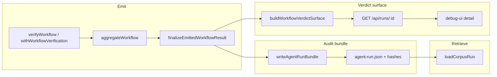

# Workflow verdict clarity and auditable run records (revised)

## Analysis

### Product requirements → engineering requirements

| Product requirement | Engineering requirement |
|-------------------|-------------------------|
| **6 — Overall workflow result** after evaluating observed steps | The emitted **`WorkflowResult`** remains the single machine verdict (`status`: `complete` \| `incomplete` \| `inconsistent`), derived only from aggregated step outcomes + run-level reasons + empty-step rule ([`src/aggregate.ts`](src/aggregate.ts)). Review surfaces must show that verdict **first**, then **`workflowTruthReport.trustSummary`**, plus step-level evidence in `steps` / `workflowTruthReport.steps`. |
| **6 — Distinguish complete vs incomplete vs inconsistent** | No new enum. UI/API must surface **`WorkflowResult.status`** and **`workflowTruthReport.trustSummary`** without requiring the user to hunt inside raw JSON. |
| **6 — Verdict supported by step evidence** | Keep authoritative per-step payloads unchanged. Add **`buildWorkflowVerdictSurface`** (`status`, `trustSummary`, `stepStatusCounts`) as a **derived, read-only summary** for review surfaces (Debug API + UI), computed in one TS implementation (not reimplemented in `app.js`). |
| **8 — Preserve execution + verification** | Persist the **canonical three-file run directory**: `events.ndjson`, `workflow-result.json`, `agent-run.json` per [`schemas/agent-run-record.schema.json`](schemas/agent-run-record.schema.json). Expose **`writeAgentRunBundle`** as the single writer used by CLI and library. |
| **8 — Link, retrieve, review** | Define **normative product behavior** (below): how bytes are bound (manifest), how consumers load a past run programmatically, and how operators review it—without inferring from “Debug happens to work.” |

### Canonical audit lifecycle (product behavior, normative)

This work does **not** introduce a second storage format.

1. **Preserve:** Call **`writeAgentRunBundle({ outDir, eventsNdjson, workflowResult })`**. The **`runId`** in `agent-run.json` is **`path.basename(path.resolve(outDir))`**, matching today’s CLI. **`workflowResult.workflowId`** must equal the manifest’s `workflowId` (same rule as [`buildAgentRunRecordForBundle`](src/agentRunRecord.ts) today).
2. **Link:** `agent-run.json` holds **`artifacts.events`** and **`artifacts.workflowResult`** with **`relativePath`**, **`byteLength`**, **`sha256`** (hex). Integrity is **exact byte equality**, not semantic re-parse.
3. **Retrieve (programmatic):** Call **`loadCorpusRun(corpusRoot, runId)`** (already exported from [`src/index.ts`](src/index.ts) / [`src/debugCorpus.ts`](src/debugCorpus.ts)). **`corpusRoot`** is the parent directory whose child **`runId`** is the run folder. Success is **`loadStatus === "ok"`**, which yields **`workflowResult`**, **`agentRunRecord`**, **`paths`**, and enough context to re-load events.
4. **Retrieve / review (interactive):** Run **`workflow-verifier debug --corpus <corpusRoot>`** and use the Debug Console; **`GET /api/runs/:id`** returns the same loaded objects the UI uses, plus the new **`workflowVerdictSurface`** field for ok rows.
5. **Review (offline):** Open **`workflow-result.json`** and **`events.ndjson`** under the run directory; interpret **`status`** / **`workflowTruthReport`** per existing SSOT. Human stderr from a **re-run** of `workflow-verifier` is optional and not required for verdict-audit acceptance.

### Empty `events.ndjson` (decided contract, not TBD)

- **`eventsNdjson` may be an empty buffer** (`byteLength === 0`). The file **must still exist** on disk (zero-byte file is valid).
- **Manifest:** `artifacts.events.byteLength === 0` and `artifacts.events.sha256` equals SHA-256 of the empty buffer (`e3b0c44298fc1c149afbf4c8996fb92427ae41e4649b934ca495991b7852b855`).
- **Loader:** [`loadEventsForWorkflow`](src/loadEvents.ts) on an empty file yields **zero non-empty lines**, zero parsed events, and **does not throw**; [`loadCorpusRun`](src/debugCorpus.ts) then succeeds **iff** byte length and hash match the manifest (same as any other size).
- **Product meaning:** “No captured run events in this bundle” is auditable and loadable; it does **not** imply a successful workflow—**`WorkflowResult`** still carries `steps`, `runLevelReasons`, and **`status`**.

### What must not happen

- No second workflow verdict enum; no **`WorkflowResult` / workflow-truth-report `schemaVersion` bump** for this verdict work.
- No alternate audit container (no DB table, no fourth required file).
- Do not weaken integrity rules in [`debugCorpus.ts`](src/debugCorpus.ts).

### What must be provable

- Machine verdict: **`WorkflowResult.status`**, **`workflowTruthReport.trustSummary`**, **`workflowVerdictSurface`** on Debug API.
- Audit: three files + manifest; **`loadCorpusRun` → ok** for golden and synthetic bundles; **integrity failure** on tamper.
- Optional in-process persistence produces bundles that pass the **same loader**.

---

## Design

### Architecture (single path)

### Bundle I/O: per-file atomicity and crash semantics (consistent)

**Design choice:** Guarantee **per-file atomic replace** (write temp in the run directory, then `rename` into place). There is **no** single syscall that atomically publishes three files; cross-file consistency is defined by **write ordering** and **manifest last**.

| Rule | Specification |
|------|----------------|
| **Buffers** | `eventsNdjson` and `JSON.stringify(workflowResult)` bytes are **fully computed in memory** before any rename to final names. |
| **Rename order** | (1) `events.ndjson`, (2) `workflow-result.json`, (3) `agent-run.json`. The manifest is always written **after** both artifact buffers are fixed and **renamed**, so a complete manifest never references incomplete artifact files. |
| **Per file** | Write `*.tmp` (unique name), `fsync` optional (not required for acceptance), `renameSync` onto final name. On Windows, if replace-by-rename is unsupported, **`unlinkSync` final then `renameSync`** from tmp (documented narrow race: only one writer per run directory). |
| **Throw during write** | Implementation **deletes the temp file(s)** created for the current attempt. **Final directory** may still contain **previous** run files from an earlier successful write; may contain **new `events`/`workflow-result` without updated manifest** if the process dies between renames—**that state is invalid** and must fail `loadCorpusRun` with **`ARTIFACT_*` / JSON errors**, same as today. |
| **Claim** | Do **not** claim “no partial bundle on crash.” **Do** claim: after `writeAgentRunBundle` returns normally, all three files exist and match the manifest; otherwise the function throws. |

### `withWorkflowVerification` + `persistBundle` lifecycle (deterministic)

**Option shape:** `persistBundle?: { outDir: string }` ( **`runId` = basename(outDir)** , identical to CLI).

**Ordered steps inside `withWorkflowVerification`:**

1. Open registry + read-only SQLite; construct **`WorkflowVerificationSession`**.
2. **`await Promise.resolve(run(observeStep))`**. If this throws, **skip steps 3–6**; propagate error; **no bundle**.
3. **`engine = session.buildWorkflowResult()`** (DB still open). If this throws, same as (2).
4. **`eventsNdjsonBytes = session.captureNdjsonUtf8()`** — **must run in the `try` block immediately after (3)** while the session object is still in scope: for each entry of **`bufferedRunEvents` in array order**, append **`JSON.stringify(event) + "\n"`** using UTF-8 encoding. **No stable sort** here: order is **strict `observeStep` enqueue order** for the session’s `workflowId` (including non–`tool_observed` v2 events), matching the doc’s in-process capture definition.
5. **`finally`:** `session.closeDbIfOpen()` (unchanged).
6. If no earlier failure: **`truthReport(formatWorkflowTruthReport(engine))`** then **`result = finalizeEmittedWorkflowResult(engine)`**.
7. If **`persistBundle`** set: **`writeAgentRunBundle({ outDir: persistBundle.outDir, eventsNdjson: eventsNdjsonBytes, workflowResult: result })`**. Uses **final** `WorkflowResult` (schema v11 + truth report), not raw engine. If this throws, **propagate** after `truthReport` has already run (stderr already emitted); caller sees failure **and** may have partial on-disk state per crash rules above.

**Explicit non-goals:** Persisting when **`buildWorkflowResult`** fails; persisting when **`finalizeEmittedWorkflowResult`** fails; persisting on operational **`verifyWorkflow`** failures (unchanged).

### Interfaces

| API | Contract |
|-----|----------|
| **`writeAgentRunBundle`** | Inputs: `outDir`, `eventsNdjson: Buffer`, `workflowResult: WorkflowResult`. **Postcondition on return:** three final filenames exist under `outDir`, manifest hashes match on-disk bytes. **Throws** on I/O / JSON stringify failure. |
| **`buildWorkflowVerdictSurface`** | Input: `WorkflowResult`. Output: `{ status, trustSummary, stepStatusCounts }` with **every `StepStatus` key present** in `stepStatusCounts`, value ≥ 0, sum of counts = `steps.length`. |
| **`GET /api/runs/:id`** | For **`loadStatus === "ok"`**, add **`workflowVerdictSurface`** from `buildWorkflowVerdictSurface(workflowResult)`. |

---

## Implementation

1. **`src/agentRunBundle.ts`:** `writeAgentRunBundle` + internal `atomicWriteFileSync` helper; manifest built from buffers; rename order as in Design. **Done when:** CLI `--write-run-bundle` calls this module and produces bit-identical layout to current behavior for the same inputs (existing golden paths).
2. **`src/cli.ts`:** Delete inlined writer; delegate to `writeAgentRunBundle`.
3. **`src/index.ts`:** Export `writeAgentRunBundle` and its options type.
4. **`src/workflowTruthReport.ts`:** Add `buildWorkflowVerdictSurface`.
5. **`src/debugServer.ts`:** Attach `workflowVerdictSurface` to ok detail JSON.
6. **`debug-ui/app.js`:** Render verdict panel from `workflowVerdictSurface` + link to raw JSON below.
7. **`src/pipeline.ts`:** Implement `captureNdjsonUtf8()` on session + `persistBundle` option with lifecycle exactly as in Design.
8. **Tests + docs** (following sections).

---

## Testing

Every case below states **exact expected outputs** or **exact error codes**—no “discover during implementation.”

1. **Round-trip (non-empty):** Use an existing fixture directory (e.g. [`examples/debug-corpus/run_ok`](examples/debug-corpus/run_ok)) or test temp: copy known `events.ndjson` bytes + `workflowResult` object, call `writeAgentRunBundle` to a **fresh** temp `outDir`, then `loadCorpusRun(parent, runId)`. **Expect:** `loadStatus === "ok"`; loaded `workflowResult.status` equals source; `agentRunRecord.artifacts.events.sha256` equals `sha256Hex` of written events bytes; same for workflow-result artifact.
2. **Empty events bundle:** `writeAgentRunBundle` with `eventsNdjson = Buffer.alloc(0)` and a minimal valid **`WorkflowResult`** JSON object (fixture or constructed) that validates against the workflow-result schema. **Expect:** `loadCorpusRun` → **`ok`**; on-disk `events.ndjson` length **0**; manifest `artifacts.events.byteLength === 0`; manifest events `sha256` equals **`e3b0c44298fc1c149afbf4c8996fb92427ae41e4649b934ca495991b7852b855`**.
3. **Integrity negative:** After (1), flip one byte in `workflow-result.json` on disk **without** updating manifest. **Expect:** `loadCorpusRun` returns **`loadStatus === "error"`** with `error.code === "ARTIFACT_INTEGRITY_MISMATCH"` (exact string per [`DEBUG_CORPUS_CODES`](src/debugCorpus.ts)).
4. **`buildWorkflowVerdictSurface`:** Table-driven fixtures with **exact** expected `status`, `trustSummary` string equality against `buildWorkflowTruthReport(finalizeEmittedWorkflowResult(engine)).trustSummary` for the same underlying engine object (or construct `WorkflowResult` with known truth report). **Expect:** `stepStatusCounts` exact object including zeros for unused statuses; sum equals `steps.length`.
5. **`withWorkflowVerification` + `persistBundle`:** Use the same minimal **sqlite + registry + single `tool_observed`** setup as an existing in-process test (or define one fixture: one row in DB matching registry expectation). **Expect:** `loadCorpusRun` **ok**; **`workflowResult.steps.length === 1`**; **`workflowResult.steps[0].status === "verified"`**; `events.ndjson` decodes to **exactly one** JSON object line matching the observed event.
6. **Debug API:** Extend [`src/debugServer.test.ts`](src/debugServer.test.ts): GET detail for a loaded ok run **Expect:** response JSON has `workflowVerdictSurface.status === workflowResult.status` and **∀ status k, sum(stepStatusCounts[k]) === steps.length** (and each count matches manual tally).

**Removed:** The prior “malformed-event-only / verify loader” placeholder—**replaced** by the **empty-events** contract (explicit hash + `ok`) and existing corpus error codes for bad bundles.

---

## Documentation

Single SSOT remains **[`docs/workflow-verifier.md`](docs/workflow-verifier.md)**. Add **structured** material (headings to implement verbatim intent):

1. **Product requirements table (workflow verdict)** — Map PR 6 → `WorkflowResult.status`, `workflowTruthReport.trustSummary`, `workflowVerdictSurface`, human `trust:` line. Map PR 8 → three-file bundle, `writeAgentRunBundle`, `loadCorpusRun`, Debug Console, manifest integrity.
2. **Engineer** — New module **`agentRunBundle.ts`**; per-file atomic write + rename order; **`captureNdjsonUtf8`** semantics (enqueue order, includes all buffered v2 run events). Reference tests that lock behavior.
3. **Integrator** — **Preserve:** call `writeAgentRunBundle` or CLI `--write-run-bundle`. **Retrieve:** `loadCorpusRun(corpusRoot, runId)` return shape. **In-process:** `withWorkflowVerification` + `persistBundle` lifecycle (numbered list mirroring Design). **Empty events:** when it occurs and that it is valid.
4. **Operator** — Debug Console verdict panel reads server field; corrupted bundle manifests surface **`ARTIFACT_*`** / **`WORKFLOW_RESULT_*`** codes; do not treat a directory as trusted until `loadCorpusRun` is **ok**.

**[`README.md`](README.md):** One short sentence pointing to the workflow verdict anchor in `workflow-verifier.md` (no second spec).

---

## Validation

| Requirement | Proof |
|-------------|--------|
| PR 6 overall verdict | `workflowVerdictSurface.status` + `trustSummary` on Debug API; `WorkflowResult.status` on disk; step counts sum to `steps.length`. |
| PR 6 vs steps | Same payload includes full `workflowResult.steps` / truth `steps`. |
| PR 6 distinguish three outcomes | Three explicit test fixtures or assertions yielding **`complete`**, **`inconsistent`**, **`incomplete`** surfaces. |
| PR 8 preserve + link | Successful `writeAgentRunBundle`; manifest SHA-256 matches files. |
| PR 8 retrieve + review | `loadCorpusRun` **ok**; Debug `GET /api/runs/:id` returns full result + surface. |
| Negative | Tamper test → **`ARTIFACT_INTEGRITY_MISMATCH`**. |
| `withWorkflowVerification` | Integration test → `loadCorpusRun` **ok**. |

**Binary verdict:** **Solved** only if all Testing items pass, documentation sections land, README pointer added, and `writeAgentRunBundle` is the sole writer from CLI + exported API. Otherwise **not solved**.
